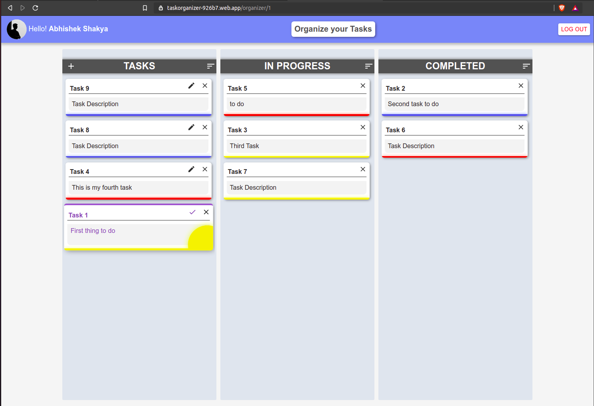

<!--
*** Thanks for checking out my project. If you have a suggestion
*** that would make this better, please fork the repo and create a pull request
*** or simply open an issue with the tag "enhancement".
*** Thanks again! Now go create something AMAZING! :D
-->

<!-- PROJECT SHIELDS -->
<!--
*** I'm using markdown "reference style" links for readability.
*** Reference links are enclosed in brackets [ ] instead of parentheses ( ).
*** See the bottom of this document for the declaration of the reference variables
*** for contributors-url, forks-url, etc. This is an optional, concise syntax you may use.
*** https://www.markdownguide.org/basic-syntax/#reference-style-links
-->

[![Contributors][contributors-shield]][contributors-url]
[![Forks][forks-shield]][forks-url]
[![Stargazers][stars-shield]][stars-url]
[![Issues][issues-shield]][issues-url]
[![LinkedIn][linkedin-shield]][linkedin-url]

<!-- PROJECT LOGO -->
<br />
<p align="center">
  <a href="https://taskorganizer-926b7.web.app/">
    
  </a>

  <h3 align="center">Desire Hub - Online Shopping</h3>

  <p align="center">
    A website based on MERN stack.
    <br />
    <a href="https://github.com/abhishekshakya/TaskOrganizers/tree/main/src"><strong>Explore the project »</strong></a>
    <br />
    <br />
    <a href="https://taskorganizer-926b7.web.app/">View Demo</a>
    <a href="https://github.com/abhishekshakya/TaskOrganizers/issues">Report Bug</a>
    <br/>
    <br/>
  </p>
</p>

<!-- TABLE OF CONTENTS -->
<details open="open">
  <summary>Table of Contents</summary>
  <ol>
    <li>
      <a href="#about-the-project">About The Project</a>
      <ul>
        <li><a href="#built-with">Built With</a></li>
      </ul>
    </li>
    <li>
      <a href="#getting-started">Getting Started</a>
      <ul>
        <li><a href="#prerequisites">Prerequisites</a></li>
        <li><a href="#installation">Installation</a></li>
      </ul>
    </li>
    <li><a href="#usage">Usage</a></li>
    <li><a href="#roadmap">Roadmap</a></li>
    <li><a href="#contributing">Contributing</a></li>
    <li><a href="#license">License</a></li>
    <li><a href="#contact">Contact</a></li>
  </ol>
</details>

<!-- ABOUT THE PROJECT -->

## About The Project

<p align="center">
<a href="https://taskorganizer-926b7.web.app/">
    
  </a>
  <br>
  <br>
  <br>
<a href="https://taskorganizer-926b7.web.app/">
    
  </a>
  <br>
  <br>
  <br>
<a href="https://taskorganizer-926b7.web.app/">
    
  </a>
  <br>
  <br>
  <br>
<a href="https://taskorganizer-926b7.web.app/">
    
  </a>

  </p>

The only objective to create this web-app was to learn about Typescript.

### Built With

- [React](https://reactjs.org)
- [Typescript](https://www.typescriptlang.org/)
- [Firebase](https://firebase.google.com/)
- [Material-UI](https://material-ui.com/)

<!-- GETTING STARTED -->

## Getting Started

Follow the instructions to set up the project on your local machine.

### Prerequisites

This is an example of how to list things you need to use the software and how to install them.

- npm
  ```sh
  npm install npm@latest -g
  ```

### Installation

1. Clone the repo
   ```sh
   git clone https://github.com/abhishekshakya/MERN-frontend-Ecomm
   ```
2. Install NPM packages
   ```sh
   npm install
   ```
3. Start the react server
   ```sh
    npm start
   ```

## Roadmap

See the [open issues](https://github.com/abhishekshakya/TaskOrganizers/issues) for a list of proposed features (and known issues).

### Things To Do

- [x] typescript
- [x] React-beautiful-dnd for drag and drop
- [x] Connect to Firestore db (for saving todos state)
- [x] Use authentication
- [x] Skeleton Loading Screen

<!-- CONTRIBUTING -->

## Contributing

Contributions are what make the open source community such an amazing place to be learn, inspire, and create. Any contributions you make are **greatly appreciated**.

1. Fork the Project
2. Create your Feature Branch (`git checkout -b feature/AmazingFeature`)
3. Commit your Changes (`git commit -m 'Add some AmazingFeature'`)
4. Push to the Branch (`git push origin feature/AmazingFeature`)
5. Open a Pull Request

<!-- LICENSE -->

## License

Distributed under the MIT License. See `LICENSE` for more information.

<!-- CONTACT -->

## Contact

Abhishek Shakya - [LinkedIn](https://www.linkedin.com/in/abhishek-shakya-374042175/) - abhishek.shakya112014@gmail.com

Project Link: [https://taskorganizer-926b7.web.app/](https://taskorganizer-926b7.web.app/)

<!-- https://www.markdownguide.org/basic-syntax/#reference-style-links -->

<!-- https://www.markdownguide.org/basic-syntax/#reference-style-links -->

[contributors-shield]: https://img.shields.io/github/contributors/abhishekshakya/MERN-frontend-Ecomm.svg?style=for-the-badge
[contributors-url]: https://github.com/abhishekshakya/TaskOrganizers/graphs/contributors
[forks-shield]: https://img.shields.io/github/forks/abhishekshakya/MERN-frontend-Ecomm.svg?style=for-the-badge
[forks-url]: https://github.com/abhishekshakya/TaskOrganizers/network/members
[stars-shield]: https://img.shields.io/github/stars/abhishekshakya/MERN-frontend-Ecomm.svg?style=for-the-badge
[stars-url]: https://github.com/abhishekshakya/TaskOrganizers/stargazers
[issues-shield]: https://img.shields.io/github/issues/abhishekshakya/MERN-frontend-Ecomm.svg?style=for-the-badge
[issues-url]: https://github.com/abhishekshakya/TaskOrganizers/issues
[linkedin-shield]: https://img.shields.io/badge/-LinkedIn-black.svg?style=for-the-badge&logo=linkedin&colorB=555
[linkedin-url]: https://www.linkedin.com/in/abhishek-shakya-374042175
